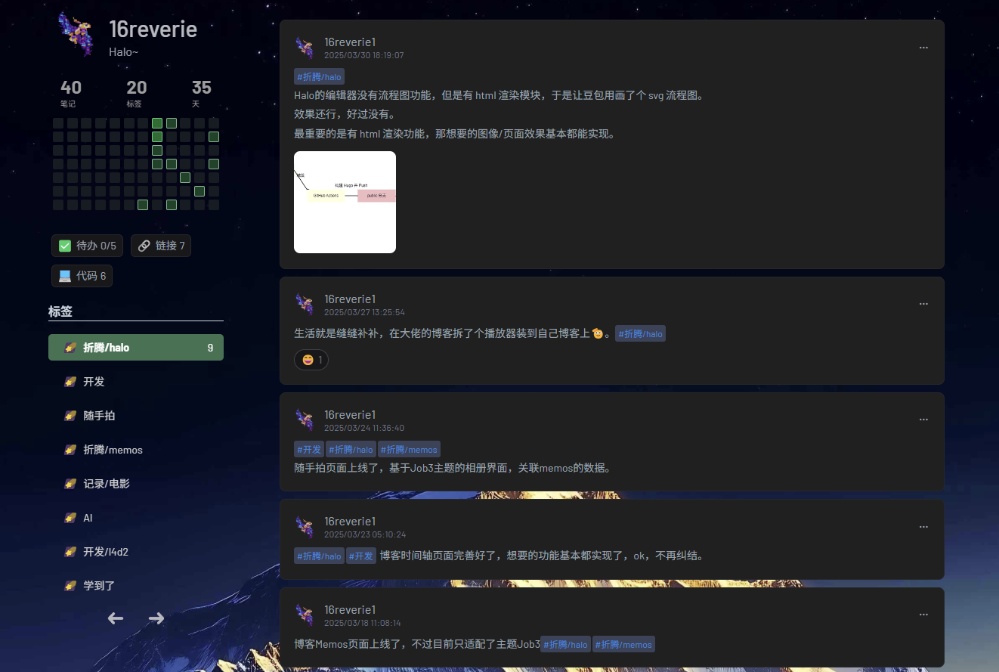
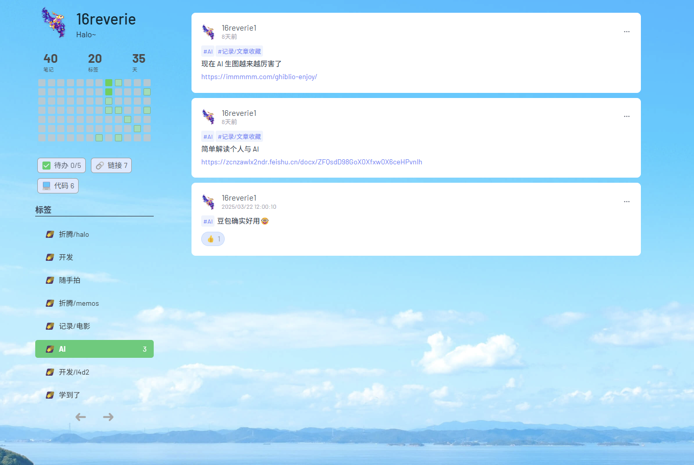

### Meflomo
一个好看的 Memos 静态展示单页

<p align="center"><a href="https://www.usememos.com/"></a></p>
<p align="center">
  
  
</p>
<p align="center">
<a href="https://ihavenoideaa.github.io/meflomos/">演示</a>
</p>

#### 简介
`Meflomo` 是一个“像” `flomo` 的 `memos` 展示静态单页。

<p align="center">
    
    
</p>

#### 特性

1. **热力图**：通过直观的热力图展示，让你能够快速了解各项 `memos` 的热度分布情况，更清晰地把握重点和关注度较高的内容。
2. **数据统计**：展示主要 Memos 数据，直观。
3. **好看的UI**：看图。
4. **标签筛选**：方便地依据不同的标签对 `memos` 进行筛选，能够迅速定位到你感兴趣的特定分类下的内容，提高查找效率。
5. **Action点赞渲染**：渲染 Memos 的 Action 点赞。
6. **暗黑模式切换**：考虑到不同的使用场景和个人偏好，提供了暗黑模式切换功能，在光线较暗的环境下使用也能获得舒适的视觉体验，同时也能减少眼睛的疲劳。
7. **配置简单**：配置十分简便，无需复杂的操作和大量的参数设置，快速搭建起属于自己的 `memos` 展示页面，同时页很便于集成到个人站点。

#### 使用方法
在`index.html`中配置 `Memos URL` 即可
```
<script>
    memosHost = 'https://memo.example.com'; #你的memos服务地址
    memosUserId = 'users/1';                #用户ID，默认用户为users/1
</script>
``` 
